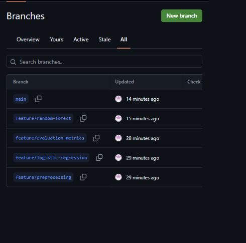
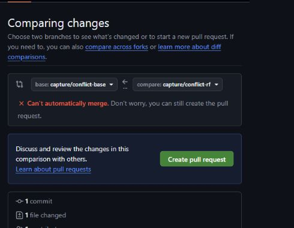
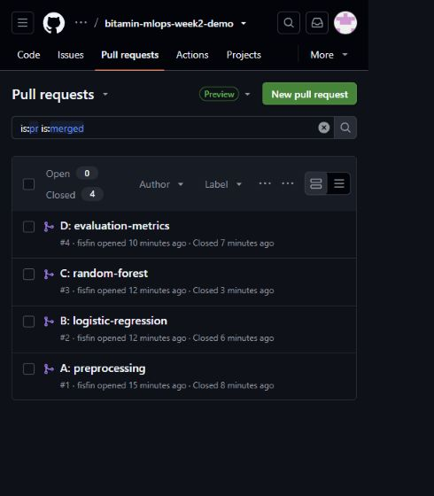

# 2주차 단일 계정 시연 기록

2026-09-19, 발표자료에 적힌 코드만 적용하여 실행한 기술 리허설입니다.
네 사람이 함께 수행한 제출물이 아니며 **타인 리뷰는 미수행**입니다.
리뷰 입력 화면은 제출하지 않은 예시로만 촬영했습니다. 실제 수업에서는 조원 전원이 다른 사람의 PR에 리뷰를 남겨야 합니다.

## 역할별 PR

공통 시작 commit: `889b94f`.

| 역할 | branch | 실제 PR | 상태 | 실제 타인 리뷰 |
|---|---|---|---|---|
| A 전처리 | feature/preprocessing | [#1](https://github.com/fisfin/bitamin-mlops-week2-demo/pull/1) | Merged | 미수행 |
| B LR | feature/logistic-regression | [#2](https://github.com/fisfin/bitamin-mlops-week2-demo/pull/2) | Merged | 미수행 |
| C RF | feature/random-forest | [#3](https://github.com/fisfin/bitamin-mlops-week2-demo/pull/3) | Merged | 미수행 |
| D 평가 | feature/evaluation-metrics | [#4](https://github.com/fisfin/bitamin-mlops-week2-demo/pull/4) | Merged | 미수행 |



## 충돌과 해결

A, D, B 순서로 실제 GitHub에서 병합했습니다. B는 LR 설정을 변경하고 C는 같은 위치를 RF로 바꿔 충돌했습니다.
C branch에서 `git fetch origin` 후 `git merge origin/main`으로 충돌을 가져왔습니다.
슬라이드 24의 build_models 함수로 LR과 RF를 모두 보존하고 실행을 확인했습니다.

- [충돌 해결 commit 9f956f4](https://github.com/fisfin/bitamin-mlops-week2-demo/commit/9f956f43fa93b7500333755114a0ba9c9732379c)
- [모델 통합 main commit 5d8f46c](https://github.com/fisfin/bitamin-mlops-week2-demo/commit/5d8f46c2b8413d55099dfd889e1dcfad8601aeb4)

아래 경고는 병합이 끝난 뒤 **충돌 직전의 동일한 두 커밋**(main `92218b8`, C `694044b`)을 임시 branch로 비교하여 다시 촬영했습니다. 촬영용 branch는 정리했습니다. 실제 참가자는 본인의 C PR에서 해결 전 경고를 캡처합니다.





## 최종 실행과 코드 확인

[실제 실행 로그](final-output.txt)

```text
=== Model comparison ===
                     accuracy  precision  recall      f1  roc_auc
Logistic Regression    0.7381     0.5043  0.7834  0.6136   0.8413
Random Forest          0.7828     0.6181  0.4759  0.5378   0.8220

Best model by F1: Logistic Regression
```

검증 환경: Windows Python 3.10.11, pandas 2.3.3, scikit-learn 1.7.2, joblib 1.6.0.
최종 app.py는 [완성 원본](https://github.com/Bo0sung/bitamin-mlops-2-snapshot/blob/1caa97f51e38bf2e71e534dca992adfca4bbbf97/app.py)과 LF 텍스트 기준으로 일치합니다.
SHA-256: `5422b825b0775d940c8bd23aaeba56aebe1e3f5247fd765a1526b0df61cc0da2`.

## 발표자가 직접 확인할 항목

- 발표 노트북의 기존 WSL·Conda 환경에서 인증·설치·학습을 확인합니다. 이 리허설의 학습은 Windows Python으로 수행했습니다.
- 조원 한 명과 실제 초대 수락 및 타인 리뷰 제출을 연습합니다.
- [week1의 실제 제출 PDF](../week1/README.md)를 열어 봅니다. 사용자가 제공한 기존 제출 파일이며 새로 실행한 1주차 결과가 아닙니다. 참가자는 자기 조의 제출 PDF를 올립니다.

이 문서와 이미지도 별도 문서 branch의 PR로 반영합니다.


## 실습 안내 개정 반영

- 기본 시작 환경은 **Windows 시작 메뉴에서 연 WSL Ubuntu 터미널**입니다. GitHub 버튼은 Chrome/Edge에서, PDF 복사는 Windows 탐색기에서 조작합니다.
- 참가자 PDF 2쪽은 인증 오류 안내입니다. 기존 clone·commit·push가 정상인 사람은 gh 설치·재로그인을 생략합니다.
- week1에는 1주차 app.py 대신 **지난주 제출 PDF**를 넣습니다. [실제 보존 파일](../week1/week1-yangseungmo.pdf)을 확인할 수 있습니다.
- VS Code 없이 `.gitignore`를 터미널의 `cat > .gitignore <<'EOF'` 블록으로 생성합니다. 코드·README는 `nano -I -l 파일명`으로 편집하고 Ctrl+O, Enter, Ctrl+X로 저장·종료합니다.
- 참가자 PDF 31~37쪽에 터미널 재접속, nano 함수 교체, 파일 복사, 캡처 저장, README 편집, 오류별 인증 복구를 설명합니다.

이번 문서 개정은 이미 완료된 역할 PR #1~#4의 코드와 충돌 해결 이력을 유지합니다.
새 안내를 여러 실제 참가자 계정으로 재실행했다는 뜻은 아닙니다. 조원 간 실제 리뷰는 수업 전 별도로 확인합니다.
